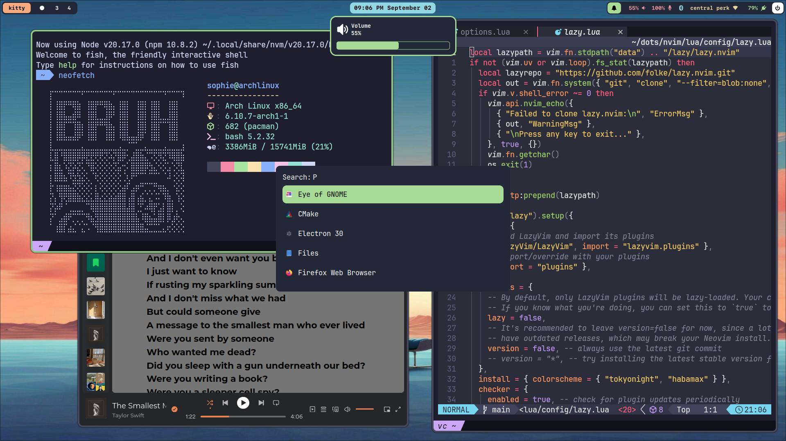

# Dots

A minimal rice for Hyprland!

| Preview                                   |
| ----------------------------------------- |
|  |

## Packages used

- **Wallpaper** - `hyprpaper`
- **Top bar** - `waybar`
- **Lock screen** - `hyprlock`
- **Screenshot tool** - `hyprshot`
- **Image viewer** - Eye of gnome `eog`
- **Notification daemon** - `dunst`
- **Menu** - `rofi-wayland`
- **Code editor** - `neovim`

## Link to themes

#### Neofetch theme

- axylfetch (<https://github.com/Chick2D/neofetch-themes>)

#### Neovim

- https://github.com/sainnhe/sonokai
- **theme**: Andromeda

## Other configurations

#### Where to place `bin` directory

- create a symlink to the system's path (i.e. `/usr/local`)

```
sudo ln -sf ~/dots/bin/ /usr/local/
```

#### Where to place the `icons` directory

```
ln -sf ~/dots/icons/ ~/.local/share/
```

#### WiFi Rofi Script

- Link [here](https://github.com/ericmurphyxyz/rofi-wifi-menu)
